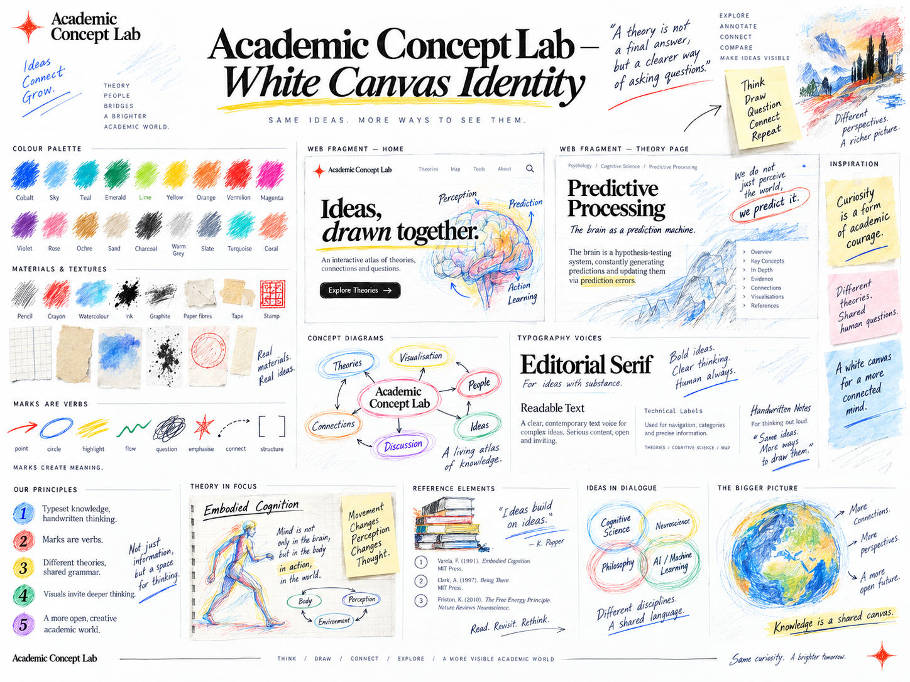
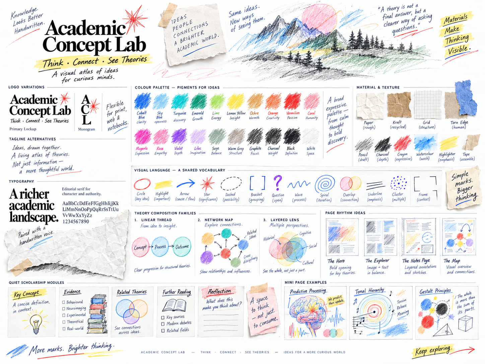
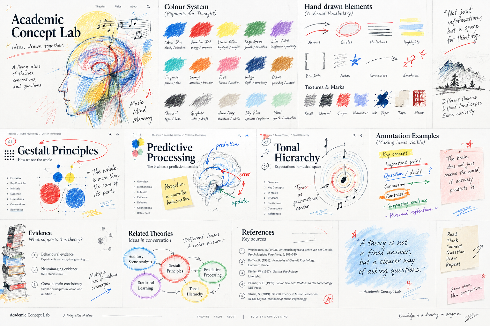
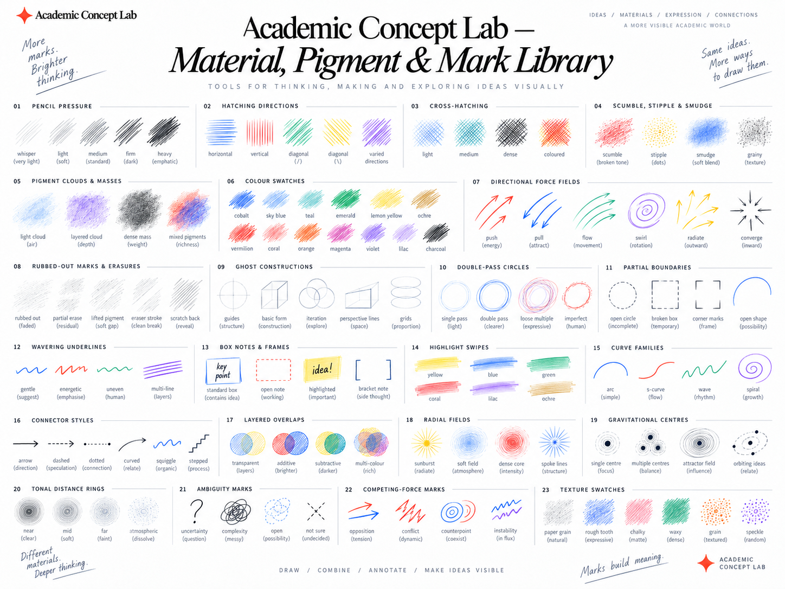
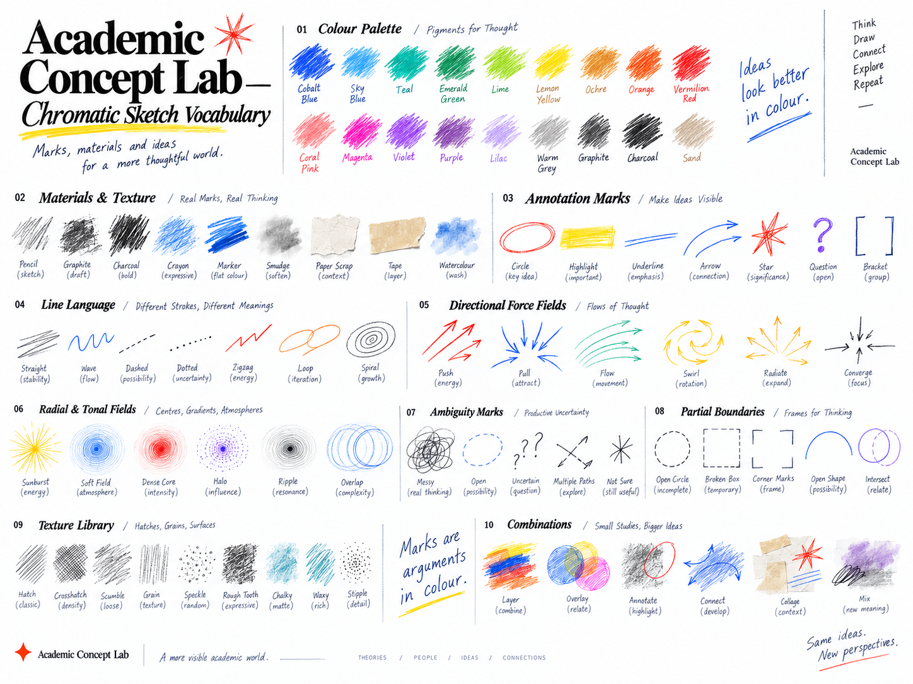
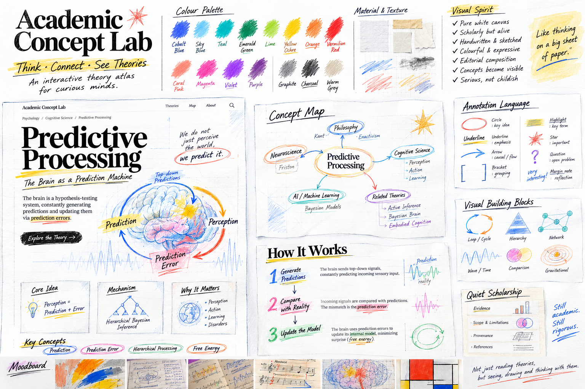

# Academic Concept Lab visual references

This directory records the visual language shared by Academic Concept Lab. Read it before a major visual design or redesign. The reference boards show a visual vocabulary. They do not prescribe page layouts.

The governing principle is SAME HAND · DIFFERENT MIND. Keep a recognisable editorial and drawn language across the site, then let each knowledge object determine its own composition and interaction.

## Use the references

1. Read the [visual grammar](VISUAL-GRAMMAR.md) to understand what the boards show and how marks can help explain knowledge.
2. Fill in the [record creative brief](RECORD-CREATIVE-BRIEF.md) before choosing page sections, artwork, or interaction.
3. Use the [visual quality review](VISUAL-QUALITY-REVIEW.md) with actual browser screenshots before presenting a design.
4. Follow the [Visual Translation Contract](../../app/concept-lab/_design/VISUAL-TRANSLATION-CONTRACT.md). Before selecting runtime artwork, inspect the [art manifest](../../app/concept-lab/_design/art-manifest.ts) and [experience manifest](../../app/concept-lab/_design/experience-manifest.ts).

These documents describe the visual language. They do not define CSS values, replace the manifests, or change academic content. The six boards below are documentation references. Do not import them into the site, register them as runtime art, or use a whole board as a page background. Text inside a board mockup is visual example material, not a source for scholarly claims or citations.

## The six reference boards

### White-canvas identity

This board sets the site-wide tone. It pairs a bright white field and formal editorial type with many pigments, drawn concepts, and a connected academic world. It feels open and curious while keeping scholarship legible.

### Page rhythm and shared vocabulary

This board explores changes in density and pace. It places expressive opening compositions beside notes, maps, quiet scholarship, and smaller examples. Treat these as possible reading rhythms, not reusable page templates.

### Applied theory and annotation

This board shows how drawn marks can sit beside academic text, evidence, references, and theory examples. It is useful for studying the relationship between live scholarship and annotations around it. Its specific page compositions and academic examples are not canonical.

### Material, pressure, and marks

This board collects pencil pressure, hatching, cross-hatching, scumbling, smudging, and erased traces. It also shows construction lines, partial boundaries, highlights, connectors, and layered pigment. Use it to study changes in mark weight and texture.

### Chromatic sketch vocabulary

This board broadens the colour and mark vocabulary. It shows many pigments, textures, line families, annotations, force fields, ambiguity marks, and combinations. It argues against treating a small accent palette as the whole artistic identity.

### Predictive-processing concept map

This board combines a sample theory page, a concept map, a process explanation, and quiet scholarship. Study how one topic can support different explanatory views. Treat the mock theory content as illustration, not evidence.

## Source inventory and repository check

The Desktop originals are in the Concept Lab Home Art Assets folder. Their PNG files remain untouched. The table lists each source name and image size. It also lists the existing GitHub copy and the new preview.

Paths in the existing-copy column are relative to docs/visual-language/references/ on branch explore/visual-reinvention-b2.

| Board | Desktop source PNG | Size | Existing PNG on GitHub | New lossless preview |
| --- | --- | --- | --- | --- |
| White-canvas identity | a7151de6-59b6-40d6-944e-e120e21ff562.png | 1448 × 1086 | identity-and-site-world/white-canvas-identity-board.png | boards/white-canvas-identity.webp |
| Page rhythm and shared vocabulary | c9650646-7ed2-4a4c-8a13-35d947a523b7.png | 1448 × 1086 | page-explorations/visual-language-page-rhythm-board.png | boards/page-rhythm-and-material-vocabulary.webp |
| Applied theory and annotation | f600a98a-dc1f-48a6-8795-d3b6807a8cdf.png | 1536 × 1024 | page-explorations/applied-theory-and-annotation-board.png | boards/applied-theory-and-annotation.webp |
| Material, pressure, and marks | 67ad1d27-7b44-44de-911c-a51a4eeecfbe.png | 1448 × 1086 | material-and-mark-language/material-pigment-mark-library.png | boards/material-pressure-and-mark-library.webp |
| Chromatic sketch vocabulary | d20b1532-b528-4317-9b56-c20f1ee7c71f.png | 1448 × 1086 | material-and-mark-language/chromatic-sketch-vocabulary.png | boards/chromatic-sketch-vocabulary.webp |
| Predictive-processing concept map | 91a4bc4f-5554-4701-8b7b-9bc3c495ad3b.png | 1536 × 1024 | diagram-and-concept-language/predictive-processing-concept-map-board.png | boards/predictive-processing-concept-map.webp |

The PNG originals already exist in the [earlier GitHub reference library](https://github.com/MioMeo999/academic-concept-lab/tree/explore/visual-reinvention-b2/docs/visual-language/references). They are byte-for-byte copies of the Desktop files.

On 2026-09-27, I checked fetched main at 9d426a6 and the active site-wide redesign branch at d9345eb. Neither branch has a reference-library path or an image blob identical to a source PNG. Both branches contain individual runtime illustrations, not the six complete boards.

This review branch adds six lossless WebP previews under boards/. After decoding, each preview has the same pixel checksum as its Desktop PNG. The previews use about 26–32% less space. The PNG originals remain on the Desktop, and this branch leaves the earlier GitHub copies unchanged.

## How Claude and Codex should use this library

Start with the Visual Translation Contract and relevant manifest entries. Use this library to study the materials, annotation range, and editorial rhythm. Then fill in the creative brief from the actual theory, study, method, or mechanism.

Choose page geometry from the knowledge. Reuse or adapt a component only when its meaning fits. Propose a reusable pattern when existing components cannot explain the knowledge. Give it a clear learning purpose. Compare actual browser screenshots with relevant boards and approved experiences. Build and test results do not replace visual review.

Keep claims, citations, evidence boundaries, and provenance in live academic content. Treat handwritten marks and artwork as teaching or editorial material unless the source and contract say otherwise.
