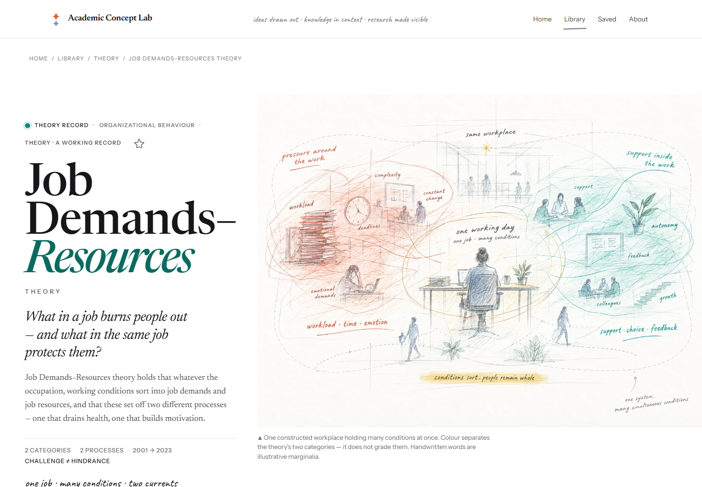
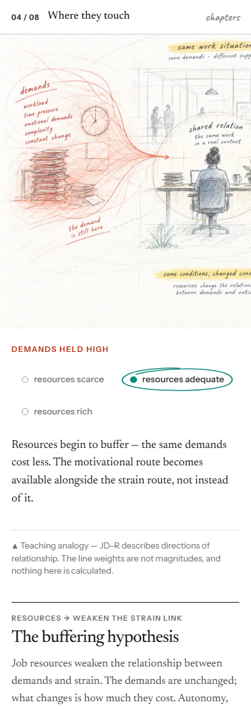
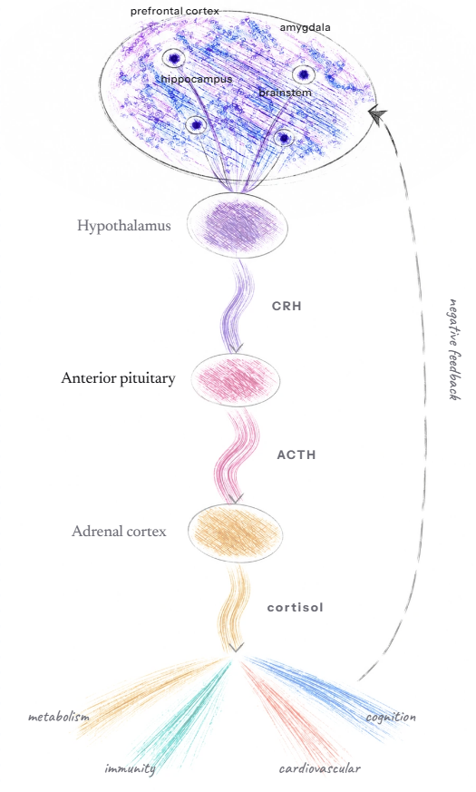
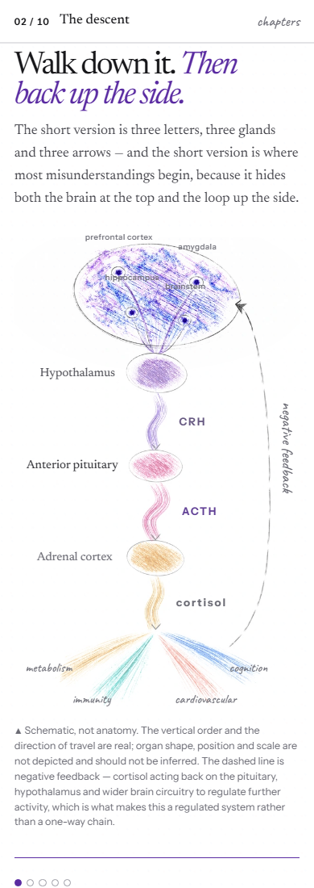
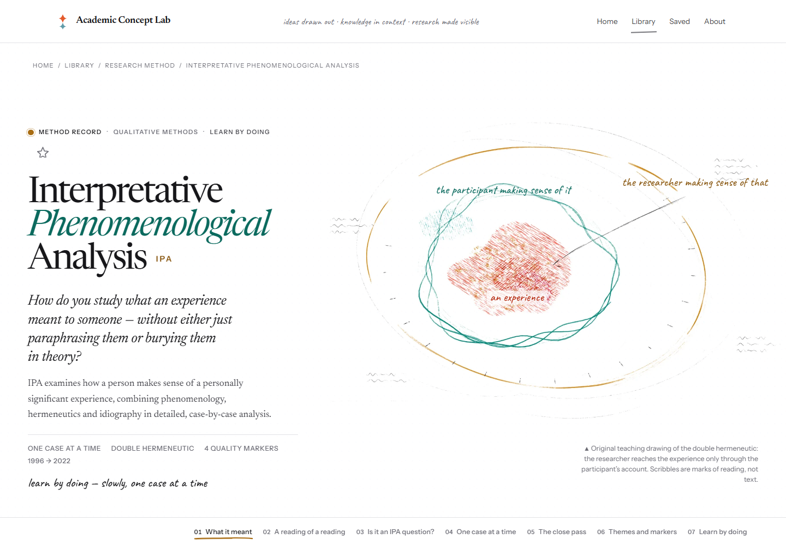
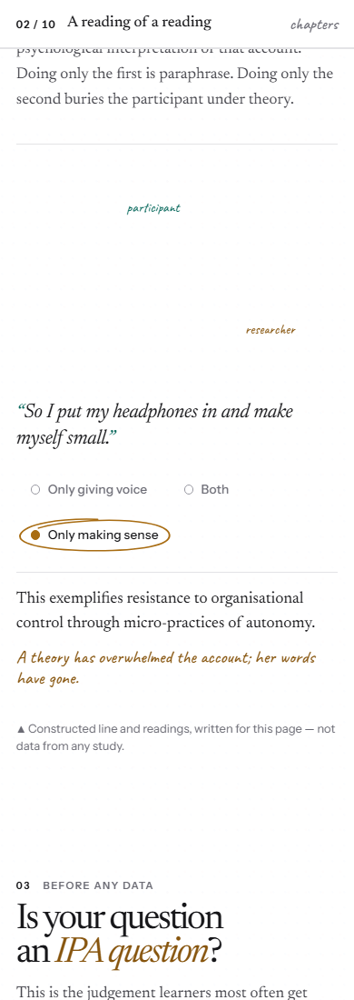
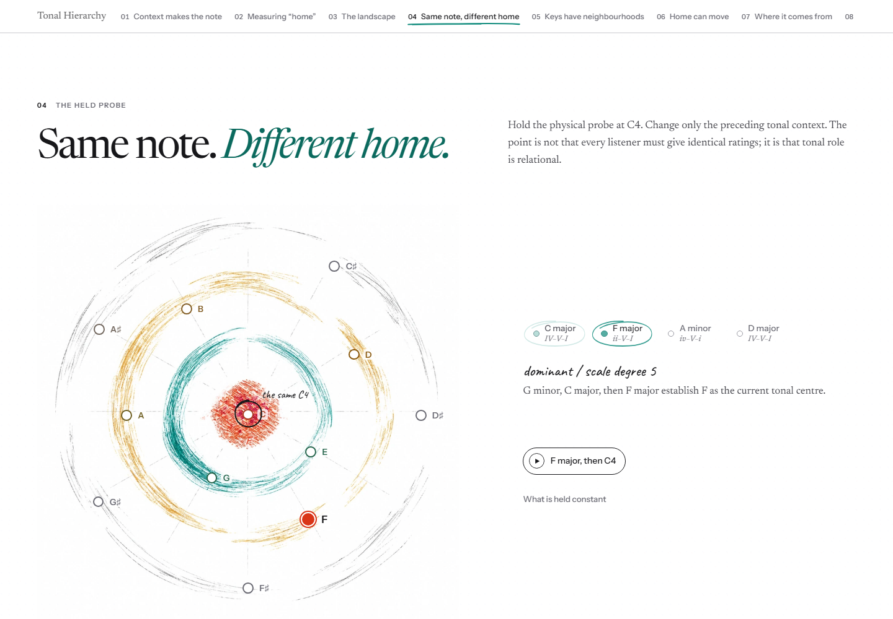
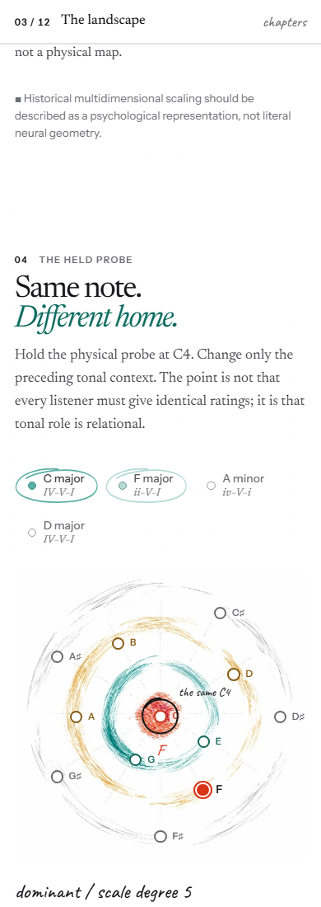

# Batch 1 creative review

**Status:** Ready for human review. Batch 2 has not started.

**Reviewed:** 27 September 2026, on `feature/sitewide-creative-redesign`, after integrating Visual Reference Foundation commit `58c6fb2`.

I read the reference README, visual grammar, record creative brief, quality review, and Visual Translation Contract. I inspected all six boards at full size, then reviewed the four records in a local browser at 1440px desktop and 390px mobile widths. The interaction captures show the selected states named below. The browser run reported no console errors; the mobile document width matched the 390px viewport on all four routes.

The boards establish a shared white editorial canvas, formal type, rich dry pigment, layered pencil pressure, marginal notes, and changes in density. They do not prescribe a layout. I used the [page rhythm board](../../boards/page-rhythm-and-material-vocabulary.webp), [material and mark library](../../boards/material-pressure-and-mark-library.webp), [chromatic sketch board](../../boards/chromatic-sketch-vocabulary.webp), [applied theory and annotation board](../../boards/applied-theory-and-annotation.webp), and [predictive-processing concept map](../../boards/predictive-processing-concept-map.webp) as comparisons where they fit each record.

The approved Home and Library, global stylesheet, benchmark routes, source claims, and evidence text are unchanged. The new HPA and Tonal files are AI-assisted teaching artwork. Labels, claims, caveats, and controls remain live HTML. Neither image represents empirical measurements.

## Job Demands–Resources

**Route:** `/concept-lab/theory/job-demands-resources`

**Decision:** Keep the artwork, composition, and interactions.

The opening illustration has a specific idea: one working day holds pressure and support at once. Red demand marks gather around the worker; teal resources gather around colleagues, choice, feedback, and room to grow. The shared yellow field keeps the two processes in one workplace. Its labels and hand-drawn paths make the model's distinctions visible without turning the page into a conventional two-column comparison.

The “Where the conditions touch” scene carries the interaction. A reader holds demands high and changes resources; the live explanation distinguishes buffering from removing the demand. The paths are teaching analogies, and the caption says line weight is not magnitude. This is already close to the page rhythm and mark-library boards: expressive density around the work, quieter scholarship around it. The phone view pans the wide scene and keeps the selected choice and its explanation available.

Other captures: [desktop selected state](images/jdr-desktop-state.png), [mobile opening](images/jdr-mobile-opening.png).

## The HPA axis

**Route:** `/concept-lab/mechanism/hpa-axis`

**Decision:** Keep the acronym-led opening and the step interaction; replace the pale procedural cascade artwork.

The opening turns the letters H, P, and A into a descent, then asks “through what” rather than “why”. That composition suits a mechanism. I kept it. The earlier cascade looked too thin at reading size. The revised field gives the appraisal region a dense blue-violet pencil mass, separates the CRH, ACTH, and cortisol stages with distinct pigments, and lets their currents descend into a fan of downstream pathways. A graphite loop climbs the right edge for negative feedback. This borrows the pressure, layered strokes, and broad pigment range of the [material board](../../boards/material-pressure-and-mark-library.webp) and [chromatic board](../../boards/chromatic-sketch-vocabulary.webp), while the page alternates the dense drawing with quiet explanation as in the [page rhythm board](../../boards/page-rhythm-and-material-vocabulary.webp).

The reader still follows the live steps while the selected link lights in the persistent drawing. The caption says vertical order and direction carry meaning, while organ shape, position, and scale do not. The asset provenance says it contains no measured concentrations or source figure. Region and stage labels remain keyboard-operable HTML buttons. The drawing teaches a pathway; it does not claim to be an anatomical map or a measured response.

Other captures: [desktop CRH state](images/hpa-desktop-state.png), [mobile full art detail](images/hpa-art-mobile.png), [desktop opening](images/hpa-desktop-opening.png), [mobile opening](images/hpa-mobile-opening.png).

## Interpretative Phenomenological Analysis

**Route:** `/concept-lab/method/interpretative-phenomenological-analysis`

**Decision:** Keep the composition, double-hermeneutic drawing, and interactions.

The nested loops give the method a distinct visual argument. The participant's sense-making encloses the experience; the researcher's interpretation surrounds that reading. The drawing makes the double hermeneutic visible without drawing a causal chain or pretending to measure an inner state. The caption and nearby text keep the relationship clear. The ochre outer trace and teal inner loops echo the layered marks in the [applied theory and annotation board](../../boards/applied-theory-and-annotation.webp) and [material board](../../boards/material-pressure-and-mark-library.webp). The open white space leaves room for the method's careful prose.

“Only making sense” changes how the same teaching quote is read, and the live annotation says when interpretation has overwhelmed the account. The page identifies that line and reading as a constructed teaching example, not study data. The interaction teaches a real methodological tension while preserving the participant's words as the object of interpretation. The loops also hold together at phone width; the method's central relationship remains visible.

Other captures: [mobile opening and full drawing](images/ipa-mobile-opening.png), [mobile art view](images/ipa-mobile-art.png), [desktop selected state](images/ipa-desktop-state.png).

## Tonal Hierarchy

**Route:** `/concept-lab/theory/tonal-hierarchy`

**Decision:** Keep the twelve pitch identities, persistent field, and context comparisons; replace the faint procedural pencil field.

The radial structure fits the theory's central distinction. Each pitch keeps its spoke while tonal context reorganises its role and distance from home. The earlier procedural orbit was difficult to see at reading size. The new field uses an interrupted teal band, an uneven ochre orbit, a vermilion centre, and light graphite construction sweeps. The broad pigment range takes cues from the [chromatic sketch board](../../boards/chromatic-sketch-vocabulary.webp) and the broken strokes from the [material board](../../boards/material-pressure-and-mark-library.webp). Reusing one field across chapters also follows the [predictive-processing concept map](../../boards/predictive-processing-concept-map.webp), which shows how a persistent subject can support different explanatory views.

With no context, the artwork and pitch markers recede, leaving twelve identities without a home. Once a context is set, the pigment and role markers return. The “same note, different home” interaction holds C4 constant while changing the preceding context. The field is qualitative; the page says the orbits are not rating values or a physical map. Live markers and keyboard controls carry the labels and state. This preserves the interaction's intellectual work while making the material legible at desktop and mobile reading sizes.

Full field captures in the selected F-major context: [desktop](images/tonal-art-desktop.png), [mobile](images/tonal-art-mobile.png). Context-free opening: [desktop](images/tonal-desktop-opening.png), [mobile](images/tonal-mobile-opening.png).

## Review decision

Batch 1 now shares the approved artistic hand without repeating one composition. JD–R and IPA already connect their marks to their academic ideas, so I left them intact. HPA needed a stronger material field; Tonal needed pigment that survives actual reading size. In both revisions, I kept the existing interaction and placed all meaning-bearing labels and caveats in live text.

All four routes remain candidates for human review. I will wait for that review before starting Batch 2.
