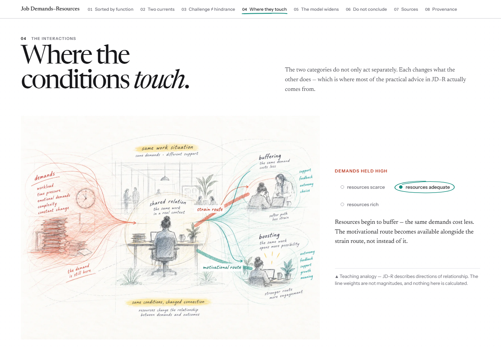
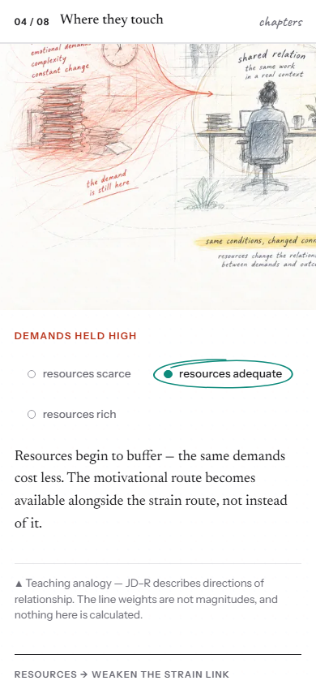
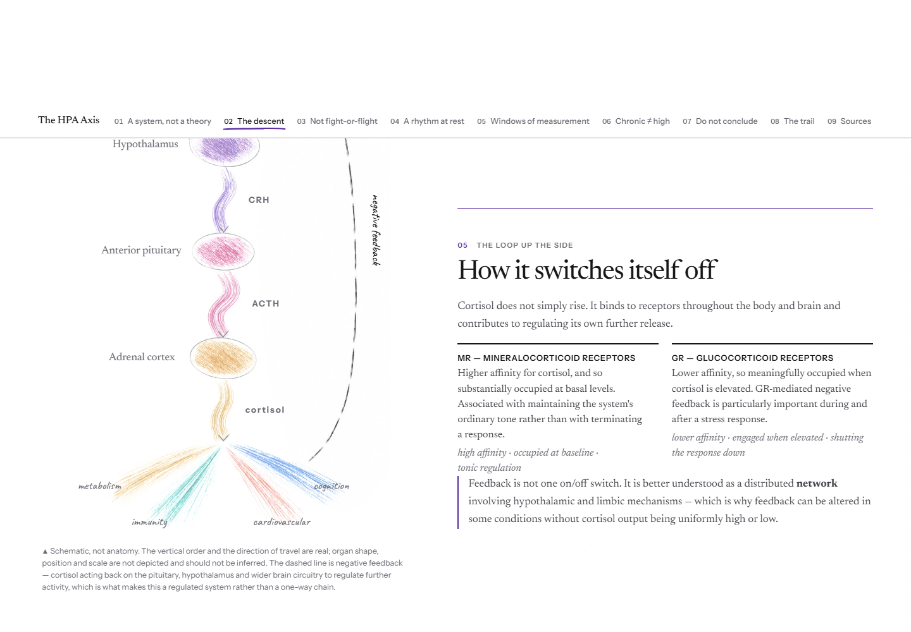
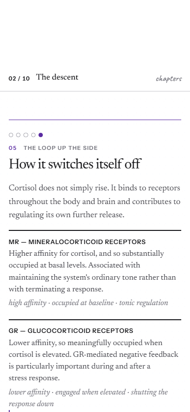
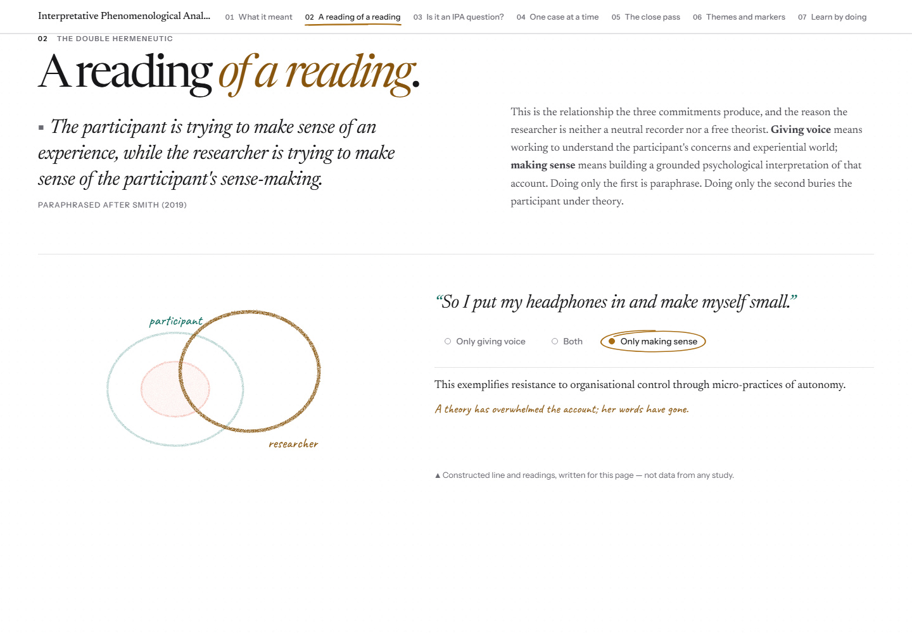
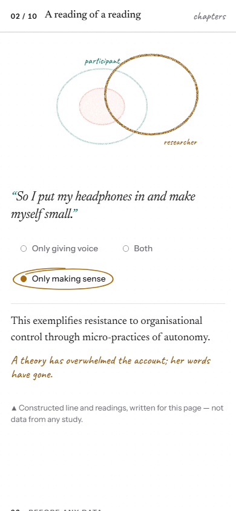
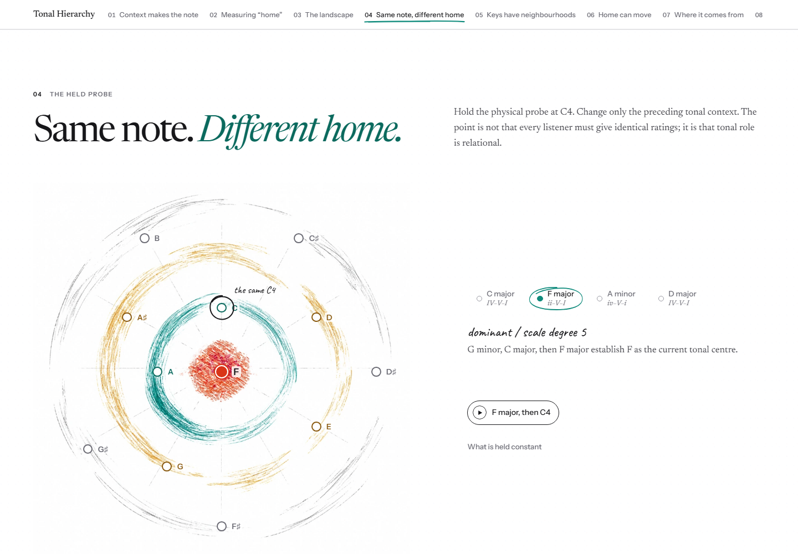
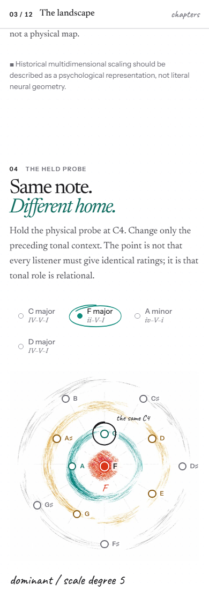

# Batch 1 final art direction review

**Status:** Ready for human visual review. Batch 2 has not started.

**Reviewed:** 27 September 2026, on `feature/sitewide-creative-redesign`.

I reviewed the complete desktop and mobile pages in a browser at 1440px and 390px widths, then checked each important selected state. The six [reference boards](../../README.md#the-six-reference-boards) and approved [Home page](final-art-direction/images/home-reference-desktop.png) guided the shared material and editorial identity. I used their white canvas, layered pencil, broad pigment, handwritten annotation, and varied reading pace as a visual vocabulary. Their compositions are not templates.

The browser review exposed a shared rendering fault: the SVG pencil filters clipped their strokes. Changing the filter region to follow each mark made the authored paths appear across JD–R, HPA, IPA, and Tonal. The large illustrations and academic content remain as reviewed; this repair reveals the interactive marks and diagrams that were already part of the explanations. One vertical Tonal chord has no two-dimensional bounds, so it renders directly without the texture filter.

## Full-page captures

Each link opens a full-page browser screenshot. The selected-state captures below show the artwork beside its live explanation where the layout allows.

| Experience | Desktop composition (1440px) | Mobile composition (390px) |
| --- | --- | --- |
| Job Demands–Resources | [Full page](final-art-direction/images/jdr-desktop-full.jpg) | [Full page](final-art-direction/images/jdr-mobile-full.jpg) |
| HPA Axis | [Full page](final-art-direction/images/hpa-desktop-full.jpg) | [Full page](final-art-direction/images/hpa-mobile-full.jpg) |
| Interpretative Phenomenological Analysis | [Full page](final-art-direction/images/ipa-desktop-full.jpg) | [Full page](final-art-direction/images/ipa-mobile-full.jpg) |
| Tonal Hierarchy | [Full page](final-art-direction/images/tonal-desktop-full.jpg) | [Full page](final-art-direction/images/tonal-mobile-full.jpg) |

## Job Demands–Resources

**Decision:** Keep the authored scenes and interaction.

One working day holds pressure and support at once. Vermilion demands converge on the worker; teal resources open a second route through the same workplace. That reading follows the directional marks in the [material board](../../boards/material-pressure-and-mark-library.webp) and the varied density of the [page-rhythm board](../../boards/page-rhythm-and-material-vocabulary.webp). It remains a workplace rather than a generic two-column model.

With demands held high, “resources adequate” makes the path legible: the same demand remains, resources buffer its cost, and a motivational route becomes available alongside strain. The selected explanation and the authored interaction scene agree. Its teaching note says that the paths show relationships, not magnitudes. No art redraw is needed.

## HPA Axis

**Decision:** Keep the revised cascade and step interaction.

The descending pathway gives the mechanism a direction: appraisal and brain circuitry, hypothalamus and CRH, pituitary and ACTH, adrenal cortex and cortisol, then downstream pathways. The graphite return line gives feedback a visible route back up the page. Live labels and the selected prose share that sequence. The [material board](../../boards/material-pressure-and-mark-library.webp) is a useful comparison for the pigment pressure; the [page-rhythm board](../../boards/page-rhythm-and-material-vocabulary.webp) helps explain the drawing’s position between quieter sections.

The caption separates teaching schematic from anatomy: order and direction carry the physiological claim, while depicted organ shape, position, and scale do not. Measurement windows appear later as a separate question about what each measure can observe. Desktop keeps the selected feedback loop beside its explanation. On mobile, the diagram introduces a linear walk through the steps; selecting a label leads to its text, while chapter numbering and pips retain the reader’s place. Returning to the diagram takes a short scroll.

[Complete HPA mobile feedback state, including the highlighted diagram and explanation](final-art-direction/images/hpa-feedback-mobile-full.jpg).

## Interpretative Phenomenological Analysis

**Decision:** Keep the authored artwork and interactions; repair the invisible live loops.

The opening nested field and the “reading of a reading” interaction now render together as one argument. The participant’s account surrounds the experience; the researcher’s loop changes position as the reader moves between giving voice, holding both commitments, and making sense. In “Only making sense,” the researcher’s loop pulls away from the account as the live text says that theory has overwhelmed the participant’s words. That relationship echoes overlap and annotation on the [applied-theory board](../../boards/applied-theory-and-annotation.webp), while keeping IPA’s own double-hermeneutic idea.

Before the filter repair, the live circles were absent in the browser; labels and choices floated in blank space. Now the lines are visible at phone size as well as desktop size. The teaching line remains explicitly constructed for this page, not study data.

## Tonal Hierarchy

**Decision:** Keep the revised interrupted-pigment field and context interaction.

The [earlier continuous field](final-art-direction/images/tonal-f-major-previous-field-desktop.png) and [revised field](final-art-direction/images/tonal-f-major-desktop.png) are shown in the same F-major reading state with C4 held constant. The earlier orbit has clear continuity but its pencil field recedes at page size. The revised teal, ochre, graphite, and vermilion marks are more legible and tactile. Their broken edges leave the orbital structure coherent: the spokes and broad rings still read as one field. This keeps some of the earlier composition’s continuity without returning to faint procedural strokes. The [chromatic board](../../boards/chromatic-sketch-vocabulary.webp) supports the richer pigment; its tonal-distance examples also caution that these rings are a qualitative teaching map, not measured distance.

The interaction makes the academic point explicit. C4 stays the same: in C major it is tonic, in F major a tonic-triad member, and in D major nondiatonic. Its marker moves relative to the selected home; the live role label names each change. The “dominant / scale degree 5” note and page caveat do not assign a quantitative value to the orbit.

Other held-C4 states: [C major desktop](final-art-direction/images/tonal-c-major-desktop.png) · [C major mobile](final-art-direction/images/tonal-c-major-mobile.png) · [D major desktop](final-art-direction/images/tonal-d-major-desktop.png) · [D major mobile](final-art-direction/images/tonal-d-major-mobile.png).

## Review decision

JD–R and IPA keep their authored artistic ideas; HPA and Tonal keep the approved artwork revisions. The browser review found and repaired a real shared weakness in the interactive drawings, then confirmed that each page’s marks now help carry its own explanation. The pages keep distinct compositions under the shared hand.

Home, Library, global styling, record claims, provenance, and citations were not changed. Lint passed and all 77 tests passed. The feature branch is for isolated Preview review; nothing was merged into `main` or deployed to Production. Batch 2 has not started.
